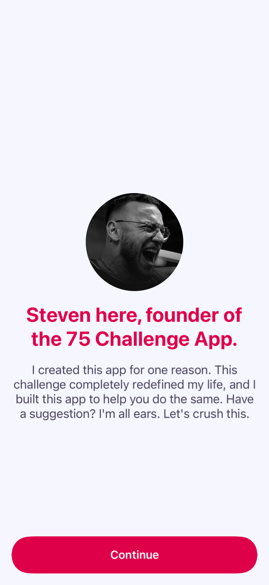
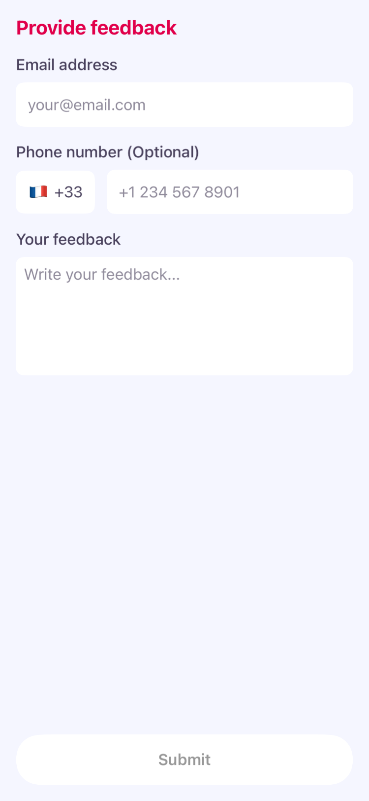
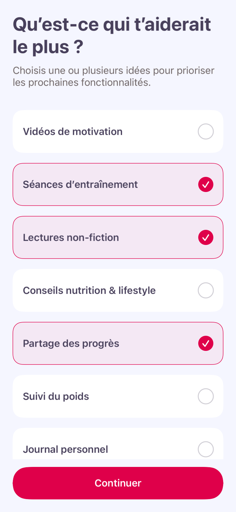
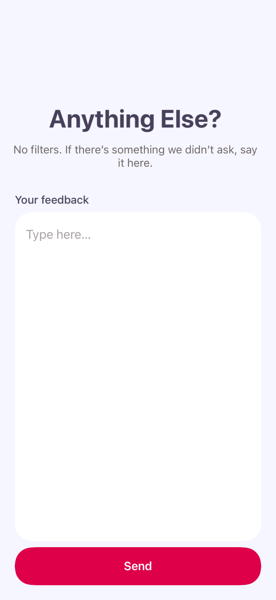
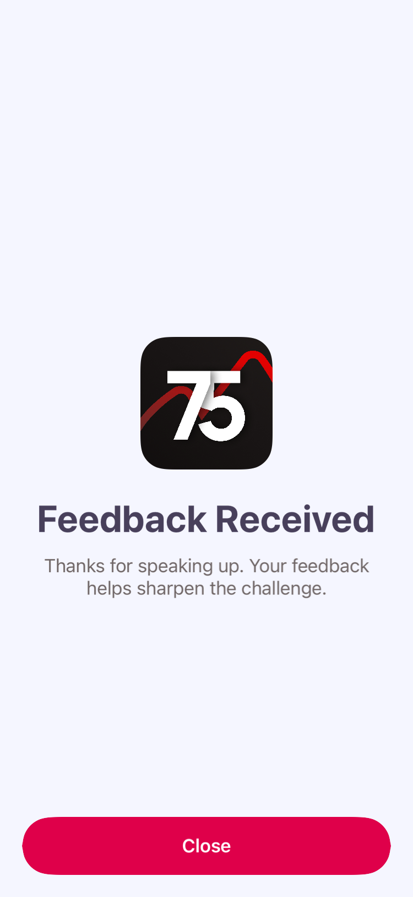

# In-App Feedback

`KovaleeSDKUI` ships two ready-made feedback flows you can present from anywhere in your app:

| Flow | What it collects | Backend (Firebase callable) |
|------|------------------|------------------------------|
| **Founder** | Free-form message + email + phone | `writeToSheet` |
| **Features** | Multi-choice survey → optional notes → confirmation | `sendForm` |

Both are SwiftUI views, available on **iOS 17+**, and auto-fill device/user metadata from the SDK.

```swift
import KovaleeSDKUI
```

The recommended entry point is **`FeedbackCoordinator`** (SwiftUI). For UIKit screens you can present the views directly with a `UIHostingController`. Both approaches are shown below.

## Examples

The flows, step by step, themed and shipping in real apps.

### Founder flow — intro → form

| | Intro | Form |
|---|:---:|:---:|
| **Example** |  |  |

After the user submits, a success alert confirms delivery.

### Features survey — choices → notes → confirmation

**Example** (all three steps):

| Choices | Notes | Confirmation |
|:---:|:---:|:---:|
|  |  |  |

---

## Configuration

All feedback content and settings are configured once through `KovaleeUI.configuration`, typically in your `App.init` or `AppDelegate.didFinishLaunching`:

```swift
KovaleeUI.configuration.appIcon         = Image("AppIcon")
KovaleeUI.configuration.feedbackChoices  = ["Daily journal", "Streaks", "Community challenges", "Other"]
KovaleeUI.configuration.feedbackStyle    = .myAppStyle      // shared by both flows (see Styling)

KovaleeUI.configuration.founderFeedbackText = FeedbackText(
    cta: "Send feedback",
    title: "Hey, I'm Dave, the founder.",
    introText: "Tell me what's working and what I should build next.",
    imageName: "founder-photo",   // an asset in YOUR app bundle
    successText: "Thanks for your feedback!"
)

KovaleeUI.configuration.featureFeedbackText = FeatureFeedbackText(
    choicesTitle: "What should we build next?",
    choicesSubtitle: "Pick the features you'd use most.",
    notesTitle: "Anything else?",
    notesSubtitle: "Tell us what would make the app better.",
    notesPlaceholder: "Type here…",
    confirmationTitle: "Feedback received",
    confirmationMessage: "Thanks for helping shape the app."
)
```

> **Firebase** — the `writeToSheet` / `sendForm` callables resolve on the default Firebase app, matching the region the rest of the app's Firebase is configured for.

---

## Metadata

Every submission carries a `FeedbackMetadata` (OS version, app version, RevenueCat id, Amplitude id, subscription status). The coordinator helpers build it for you automatically — you only need it when constructing a configuration manually for UIKit.

```swift
let metadata = await FeedbackMetadata.fromKovalee()
```

---

## Founder flow

### SwiftUI

Hold a `FeedbackCoordinator`, attach the `.userFeedback(coordinator:)` modifier, and call `showFounder()`:

```swift
struct SettingsView: View {
    @State private var feedback = FeedbackCoordinator()

    var body: some View {
        Button("Contact support") {
            feedback.showFounder()
        }
        .userFeedback(coordinator: feedback)
    }
}
```

Copy and styling come from `KovaleeUI.configuration` (see [Configuration](#configuration)) — there's nothing to pass at the call site.

### UIKit

Present the view directly, constructing the configuration from `KovaleeUI.configuration`:

```swift
@IBAction func contactSupport(_ sender: Any) {
    Task {
        let configuration = UserFeedbackConfiguration(
            feedbackText: KovaleeUI.configuration.founderFeedbackText,
            feedbackStyle: KovaleeUI.configuration.feedbackStyle,
            feedbackMetadata: await .fromKovalee()
        )
        present(
            UIHostingController(rootView: UserFeedbackView(configuration: configuration, showBackButton: true)),
            animated: true
        )
    }
}
```

---

## Features survey

A 3-step flow: **choices** (multi-select) → **notes** (optional free text) → **confirmation**. On the notes step it calls the `sendForm` Firebase function with the selected choices and notes.

### SwiftUI

```swift
struct HomeView: View {
    @State private var feedback = FeedbackCoordinator()

    var body: some View {
        content
            .userFeedback(coordinator: feedback)
            .onAppear { showSurveyIfNeeded() }
    }

    private func showSurveyIfNeeded() {
        feedback.showFeatures(
            onChoicesButtonTapped: { Analytics.log("survey_choices_submitted") },
            onNotesActionTapped: { Analytics.log("survey_completed") }
        )
    }
}
```

Copy, styling, choices, and the app icon all come from `KovaleeUI.configuration` (see [Configuration](#configuration)) — there's nothing to pass at the call site.

### UIKit

Present `FeedbackFormView` directly. `featureFeedbackText` is optional on the configuration, so unwrap it first:

```swift
Task {
    guard let text = KovaleeUI.configuration.featureFeedbackText else { return }
    let config = FeatureFeedbackConfiguration(
        style: KovaleeUI.configuration.feedbackStyle,
        text: text,
        appIcon: KovaleeUI.configuration.appIcon,
        choices: KovaleeUI.configuration.feedbackChoices,
        metadata: await .fromKovalee()
    )
    let form = FeedbackFormView(
        primaryColor: config.style.primaryColor,
        secondaryColor: config.style.secondaryColor,
        backgroundColor: config.style.backgroundColor,
        secondaryBackgroundColor: config.style.secondaryBackgroundColor,
        ctaColor: config.style.ctaColor,
        selectedColor: config.style.selectedColor,
        unselectedColor: config.style.unselectedColor,
        buttonCornerRadius: config.style.buttonCornerRadius,
        appIcon: config.appIcon,
        choices: config.choices,
        choicesTitle: config.text.choicesTitle,
        choicesSubtitle: config.text.choicesSubtitle,
        notesTitle: config.text.notesTitle,
        notesSubtitle: config.text.notesSubtitle,
        notesPlaceholder: config.text.notesPlaceholder,
        confirmationTitle: config.text.confirmationTitle,
        confirmationMessage: config.text.confirmationMessage,
        feedbackMetadata: config.metadata,
        onComplete: { [weak self] in self?.dismiss(animated: true) }
    )
    present(UIHostingController(rootView: form), animated: true)
}
```

---

## Styling

Both flows share a single `FeedbackStyle`. All fields are defaulted, so `.default` works out of the box. Set it once via `KovaleeUI.configuration.feedbackStyle`:

```swift
extension FeedbackStyle {
    static let myAppStyle = FeedbackStyle(
        backgroundColor: Color("background"),
        primaryColor: .white,                      // titles
        secondaryColor: .white.opacity(0.8),       // subtitle / body / notes text
        secondaryBackgroundColor: Color("card"),   // fields & unselected chip background
        ctaColor: Color("accent"),                 // CTA + selected chip (tinted bg & border)
        selectedColor: .white,                     // selected chip label
        unselectedColor: .white,                   // unselected chip label
        buttonCornerRadius: 16,                    // CTA / chip corner radius
        symbol: nil                                // optional SF Symbol on the founder CTA
    )
}
```

> Note: the selected chip uses `ctaColor` (a faint `ctaColor.opacity(0.06)` fill with a `ctaColor` border), the unselected chip uses `secondaryBackgroundColor`, and `secondaryColor` is the subtitle / notes-text color.

---

## Notes

- All views require **iOS 17+** (`@available(iOS 17, *)`).
- The founder `imageName` and the features `appIcon` must resolve to assets in **your app's** bundle.
- Submissions show a retry alert when the Firebase callable fails; make sure the `writeToSheet` / `sendForm` callables exist in your project.
- `FeedbackCoordinator` is `@MainActor @Observable`; create it with `@State` in SwiftUI and keep one instance per host view.
